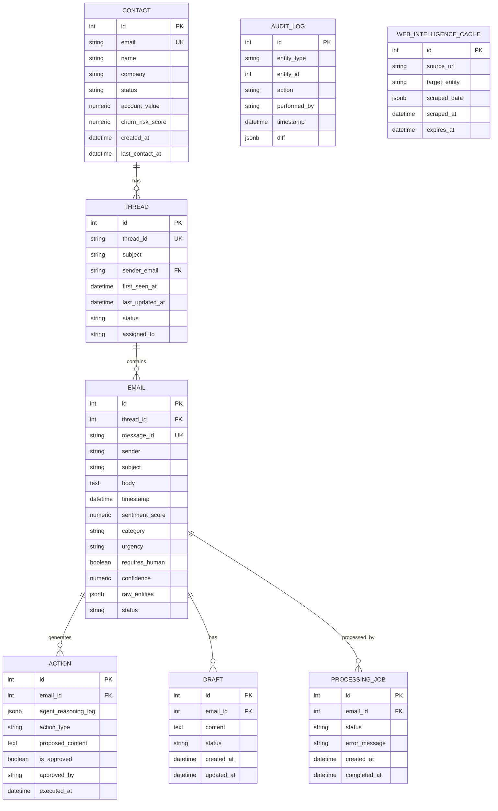

# Agentic CRM Architecture & Data Model

## Architecture Diagram

```mermaid
flowchart TD
    subgraph Frontend [Dashboard UI (React / Vite)]
        Inbox[Mission Control Inbox]
        Thread[Thread Workspace]
        Analytics[Analytics Dashboard]
    end

    subgraph API [FastAPI Backend]
        Ingest[Ingestion Pipeline]
        JobProc[Job Processor]
        Endpoints[REST Endpoints]
    end

    subgraph Intelligence [Multi-Layer Intelligence Engine]
        Heuristics[Layer 1: Heuristic Filter]
        LLMClass[Layer 2: LLM Classifier]
        RAG[Layer 3: RAG Knowledge]
        Agent[Layer 4: Autonomous Triage Agent]
        WebIntel[Layer 5: Web Intelligence Scraper]
    end

    subgraph Data [Data & Storage]
        Postgres[(PostgreSQL)]
        ChromaDB[(ChromaDB Vector Store)]
    end

    %% Flow
    Frontend <--> |HTTP/REST| API
    Ingest --> |Queue| JobProc
    JobProc --> Heuristics
    JobProc --> LLMClass
    LLMClass <--> RAG
    JobProc --> Agent
    Agent <--> RAG
    Agent <--> WebIntel
    
    API <--> Postgres
    RAG <--> ChromaDB
```

## Entity-Relationship (ER) Diagram


